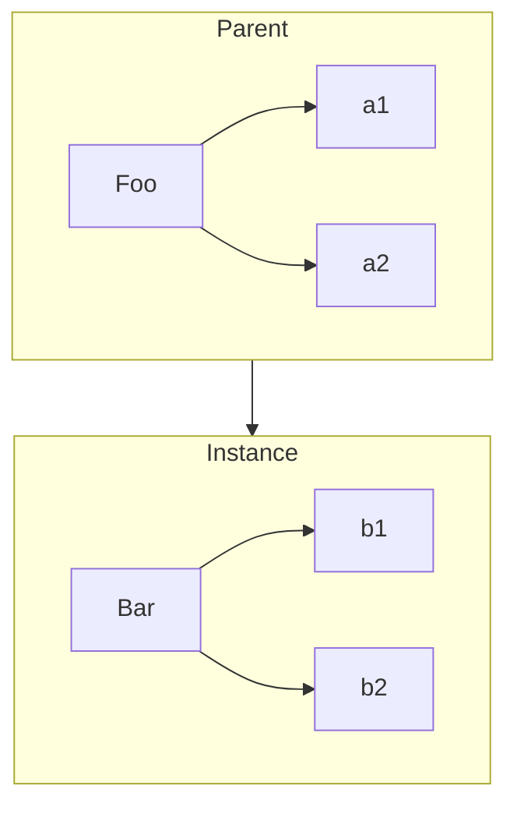
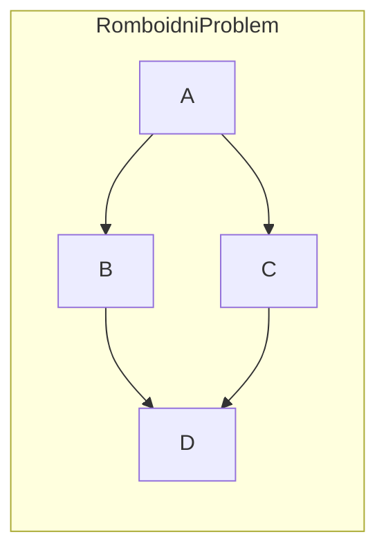

# Mesanje objekta "klasa"

## Teorija klasa

Pojam klasa/nasledjivanje opisuje odredjen oblik organizovanja i arhitekture koda.

OOP istice da je priroda podataka da se uz njih uvek vezuje odredjeno ponasanje koje uticu na podatke, pa zato ispravan dizajn treba da spakuje zajedno i podatke i ponasanja.

>Grupa znakova koja predstavlja rec ili recenicu govornog jezika se naziva znakovni niz (string). Znakovi su podaci.
>
>Gotovo nikada nisu vazni samo podaci, vec obicno sa njima nesto radimo, pa se zato sva ponasanja koja se mogu primeniti na te podatke realizuju u obliku metoda klase String
>>Izracunavanje duzine stringa, dodavanje novih podataka, pretrazivanje...

Svaki znakovni niz je instanca svoje klase -> vesto upakovan paket podataka i funkcionalnosti koju mozemo primeniti na njih.

Svaku strukturu zamisljamo kao specificnu varijantu opstije osnove definicije.

>Kao primer mozemo uzeti _Automobil_, za koga se moze reci da je specificnija varijanta opstije klase koja se zove _vozilo_

**Polimorfizam** ideja da se dato opste ponasanje (deklarisano u roditeljskoj klasi) moze zameniti tako da se postigne specificnije ponasanje.

>Praksa je da se zamenjenoj funkciji u izvedenoj klasi ostavi isto ime funkcije kao u roditeljskoj

### Model projektovanja softvera pomocu "klasa"

_Proceduralno programiranje_ nacin za opisivanje koda koji se sastoji iskljucivo od procedura (funkcija) koje pozivaju druge funkcije.

Primena klasa je ispravan nacin da proceduralni "spageti kod" pretvorimo u pravilno formatiran i dobro organizovan kod.

### JavaScript "klase"

JavaScript, za razliku od OOP jezika, nema klase.

Ono sto je ES6 od skoro uveo, rezervisanu rec _class_ je samo pokusaj neke implementacije koriscenja klasa.

>U ovom momentu sam shvatio zasto autor stavlja u naslovu navodnike na reci klase.

## Mehanika klasa

U mnogim jezicima koji su orijentisani na klase, "standardna biblioteka" stavlja na raspoljaganje strukturu podataka tip _stek_ u obliku klase koja se zove _Stack_.

### Zgrada

Metafora za "klase" i "instance" pozajmljena je iz gradjevinarstva.

Klasa se moze zamisliti kao arhitektonski crtez zgrade.

Arhitekta na crtez ucrtava sirinu, visinu, broj prozora, na kojoj visini, sirini... On ne brine o tome cime ce ta zgrada biti popunjena (stanovi, kancelarije...) vec gleda samo siroku sliku.

Zatim preduzimac preuzima taj crtez i primenjuje ga na pravi svet, praveci stvarnu kopiju prema onome sto mu je arhitekta nacrtao. Moze se desiti da je na crtezu ucrtan neki deo koji ne moze biti primenjen na stvarnom svetu, pa ce morati biti dorade (menjanje svhe funkcije tako da odgovara izvedenoj klasi).

Kada zavrsi sa tom zgradom, preduzimac moze da nastavi da gradi zgrade po tom istom principu koji mu je predlozio arhitekta (mogu da izvodim vise klasa iz osnovne).

Crtez je samo klasa, sa njim ne mogu fizicki nista uraditi. Ako zelim otvoriti vrata zgrade, moram napraviti instancu crteza (moram izgraditi zgradu).

Klasa se instacira u objektni oblik pomocu operacije kopiranja:



### Konstruktor

Kada pravimo instancu klase mi ustvari pozivamo specijalnu metodu unutar parent objekta koji ima ime parent klasa i koja se zove **konstruktor**. Od konstruktora dobijamo (funkcija vraca) objekat.

```js
// Ovo je samo pseudokod

class CoolGuy {
  specialTrick = nothing;

  CoolGuy(trick) specialTrick = trick;

  showOff() output("Evo sta ja umem: " + specialTrick);
}

// Da bi napravio instancu klase _CoolGuy_ moram pozvati njen konstruktor

Tim = new CoolGuy("da preskacem konopac");
Tim.showOff(); // "Evo sta ja umem: da preskacem konopac"
```

Konstruktore uvek treba pozivati uz rez. rec _new_ kako bi masini nagovestili da zelimo napraviti novu instancu klase.

## Nasledjivanje klasa

Cesto se kaze da je druga klasa "izvedena", a prva klasa "roditelj".

Kada dete zapocne svoj zivot, ono se razdvaja od roditelja. Na dete utice genetsko nasledje koje je dobilo od svog roditelja, ali ono je zasebna jedinka. Ako dete ima ridju kosu, to ne znaci da je kosa roditelja obavezno bila ridja, niti da ona automatski postaje ridja.

> Metafora na izvedenu i roditeljsku klasu.
>
>Kada napravimo instancu klase, ona je zasebna za sebe. Nasledila je ponasanja roditelja, ali je to ne sprecava da menja ta ponasanja ili cak da i doda nova ponasanja

```js
// pseudokod (izmisljena sintaksa)

class Vehicle{
  engines = 1;

  ingnition() output("Pokrecem motor");
  drive(){
    ingnition();
    output("Vozilo je u pokrtu");
  }
}

class Car inhrits Vehicle{
  wheels = 4;

  drive(){
    inherited:drive()
    output("Vozim na ", wheels, " tocka");
  }
}

class SpeedBoad inherts Vehicle{
  engines = 2;

  ingnition() output("Pokrecem ", engines, " motora");

  pilot(){
    inherited: drive();
    output("Brzo i lako klizim po vodi");
  }
}
```

>Klasa _Vehicle_ je genericka klasa, jer se sa njom ne mogu praviti vozila, vec smo to ucinili praveci instance genericke (_Vehicle_) i dodavajuci im potrebna dodatna ponasanja

### Polimorfizam

Nastvaljajuci se na prethodni primer o vozilima, klasa _Car_ redefinise nasledjenu metodu _drive()_.

Ova tehnika se naziva **polimorfizam**. Praktikuje ideju da svaka metoda moze da referencira drugu metodu (istog ili razlicitog imena) na visem hijerarhijskom nivou nasledjivanja.

U nekim se jezicima umesto _inherited:_ koristi rez. rec _super_ (sto odrazava ideju da je "superklasa" roditelj/predak tekuce klase)

Jos jedna ideja polimorfizma jeste da jedno ime metode moze imati razlicite definicije na razlicitim nivoima lanca nasledjivanja. Tada se definicija automatski bira  kada se razresava koja je tacno metoda pozvana.

>Mozemo videti u primeru za vozila, metoda _drive()_ je definisana u klasi _Vehicle_ ali takodje i u klasi _Car_.
>
>Takodje i za metodu _ingnition()_ koja je definisana u klasi _Vehicle_ i u klasi _SpeedBoat_
>
>Koja ce definicija metode biti pozvana zavisi od toga na kom se nivou lanca nasledjivanja nalazimo

Tradicionalni jezici orijentisani na klase pruzaju, pomocu rezervisane reci _super_, direktan nacin da konstruktor nasledjene klase referencira konstruktor svoje roditeljske klase. To je izvodljivo najvecim delom jer u stvarnim klasama konstruktor pripada klasi.

U JavaScriptu je to malo drugacije, u njemu je primer da "klasa" primada konstruktoru. Razlog je taj sto u JS-u veza izmedju izvedene i roditeljske klase postoji samo izmedju dva _.prototype_ objekta odgovarajucih konstruktora. Nema direktne veze izmedju samih konstruktora, pa zato ni nema jednostavnog nacina da se relativno referencira jedan iz drugog.

Zanimljiva posledica polimorfizma moze se konkretno videti na primeru metode _ignition()_. U metodi _pilot()_ postoji relativna polimorfna referenca na verziju metode _drive()_ koja je nasledjena od klase _Vehicle_. Ali ta metoda _drive()_ referencira metodu _ignition()_ samo po imenu.

U tom slucaju definicija metode _ignition()_ je polimorfna (promenljiva), zavisno od toga cija je instanca klase koju referenciramo.

**Svaka izvedena klasa ima kopiju onoga sto joj treba od roditeljske klase.**

### Visestruko nasledjivanje

Ako bi izvedenu klasu poredili sa detetom (nasledjuje DNK, dva roditelja) znaci da bi onda ta klasa trebala da ima kopiju i jedne i druge parent klase.

To se u jezicima orijentisanim na klase praktikuje, ali je u JavaScriptu ta mogucnost izbacena.

Razlog tome je kada se pogleda malo dublje. Ako bi zaista izvedena klasa trebala da ima kopiju i jedne i druge roditeljske klase, ukoliko su i one izvedene iz neke zajednicke klase, i ako se redefinise neka od metoda (polimorfizam), kako ce se znati koja se definicija metode poziva iz izvedene klase?



>Kako ce se sada znati koja definicija ce se koristit, ako se u klasama _B_ i _C_ redefinise neka polimorfna metoda iz klase _A_ i pozove u klasi D?

## Mesaci

Prilikom pravljenja instance klase, JS mehanizam ne kopira ponasanja automatski. U JavaScriptu neka "klasa" koje bi nasledjivale jedna drugu, vec ima samo objekte. A objekti se ne kopiraju u druge objekte, nego se medjusobno povezuju (vise o ovome u poglavlju 13).

A posto drugi objektno orijentisani jezici podrazumevaju i kopiranje prilikom instanciranja klasa, JS programeri su nasli nacin da simuliraju to, a to je uz pomoc koriscenja **mesaca** (**mixin**).

Mesaci se dele na:

- eksplicitne
- implicitne

### Eksplicitni mesaci

```js
// pojednostavljen izgled funkcije mixin(..)
// u JS bibliotekama / frejmvorkovima ta funkcija se cesto zove extend(..)

function mixin(sourceObj, targetObj){
  for(var key in sourceObj){
    // kopirati samo ako targetObj[key] != sourceObj[key], ako nemaju isto ime metode
    if(!(key in targetObj)) targetObj[key] = sourceObj[key];
  }

  return targetObj;
}

var Vehicle = {
  engines: 1,

  ignition: function(){
    console.log("Pokrecem motor");
  },
  drive: function(){
    this.ignition();
    console.log("Vozilo je u pokretu");
  }
};

var Car = mixin(Vehicle, {
  wheels: 4,

  drive: function(){
    /*
    // Pozivam metodu drive(..) iz objekta Vehicle,
    // ali postavljajuci tako da se poziva iz konteksta
    // objekta Car
    //
    // Odnosno, eksplicitno zadajemo objekat Vehicle
    // po imenu i pozivamo njegovu funkciju drive(..)
    */
    Vehicle.drive.call(this);
    console.log("Idem na " + this.wheels + " tocka");
  }
});
```

> Sada objekat _Car_ ima reference na svojstva i funkcije objekta _Vehicle_. Nista se ne kopira u drugi objekat. Svi su oni zasebni. Vec se samo iz jednog referencira na svojstva i metode izvornog objekta
>
> Primetiti da je uslov petlje funkcije _mixin(..)_ da "izvedeni" objekat ima metodu istog imena, i tada se izlazi iz uslova i nastavlja se kopiranje dalje. Znaci da se ne redefinise definicija metode "izvedenog" objekta

#### Ponovo o polimorfizmu

U jezicima orijentisanim na klase i koji imaju relativni polimorfizam, veza izmedju _Vehicle_ i _Car_ uspostavlja se jednom, na pocetku definicije klase, usled cega postoji samo jedno mesto za odrzavanje te veze.

#### Mesanje kopija

Ime _"mesac"_ potice od alternativnog opisa celog postupka: u targetObj se "umesava" sadrzaj iz sourceObj.

Posto se u JavaScript-u funkcije ne mogu duplirati, ono sto se ustvari dobija jeste duplirana referenca na isti deljeni objekat.

Ako u jednom od deljenih objakata promenim nesto, to znaci da ce ta izmena biti primenjena i u roditeljskom, a i u svakom izvedenom objektu.

Ako eksplicitno pokusam da umesam dva ili vise objekata u ciljni objekat, nema nacina da obradim sukob ako se ista metoda ili svojstvo kopira iz vise od jednog izvora.

>Iako su programeri uspeli da nadju resenje za to, kao sto je primenjeno i u nekim od biblioteka, takozvana tehnika "kasnog povezivanja", zahteva vise truda a i daje slabije performanse

**Preporuka** je da se mesaci koriste tamo gde oni doprinose da kod bude razumljiviji, a izbegavaj ako primetis da u tako dobijenom kodu teze otkrivas sta je uzrok greske ili ako formira nepotrebne i kompikovane zavisnosti izmedju objekata.

_Ako pocinje da vam postaje teze da ispravno koristite mesace nego sto vam je bilo dok ih niste koristili, verovatno bi trebalo da odustanete od upotrebe mesaca.

#### Parazitsko nasledjivanje

Je varijanta eksplicitnog mesaca koji je istovremenom u jednom smisli eksplicitna, a u drugom smislu implicitna.

```js
function Vehicle() this.engines = 1;

Vehicle.prototype.ignition = function(){
  console.log("Pokrecem motor");
}

Vehicle.prototype.drive = function(){
  this.ignition();
  console.log("Vozilo je u pokretu");
}

// Parazitska klasa 'Car'
function Car(){
  var car = new Vehicle();

  car.wheels = 4;

  // kopija reference na Vehicle::drive()
  var vehDrive = car.drive;

  // redefinise Vehicle::drive()
  car.drive = function(){
    vehDrive.call(this);
    console.log("Vozim na " + this.wheels + " tocka");
  }

  return car;
}

var myCar = new Car();

myCar.Drive();
// Pokrecem motor
// Vozilo je u pokretu
// Vozim na 4 tocka
```

### Implicitni mesaci

Tesno su povezani sa eksplicitnim pseudopolimorfizmom, tako da ista pravila i ogranicenja vaze i za implicitne mesace.

```js
var something = {
  cool: function(){
    this.greeting = "Helo World!";
    this.count = thic.count ? this.count + 1 : 1;
  }
};

/*
// Pozivam funkciju kako bi se napravo prototip,
// i a postavile vrednosti promenljivih greeting i count
*/
something.cool(); 
something.greeting; // Hello World!
something.count; // 1

var another = {
  cool: function(){
    // implicitno umesavanje 'something' u 'another'
    something.cool.call(this);
  }
};

another.cool();
another.greeting; // Hello World!
another.count; // 1
```

Pozivanjem _something.cool.call(this)_ (sto se najcesce cini u konstruktoru ili unutar metode) pozajmljujemo funkciju _something.cool()_ i pozivamo je kontekstu objekta _another_.

Iako se cini da je ova tehnika koristi prednosti ponovnog povezivanja this, njegova najslabija tacka je sam poziv funkcije (_something.cool.call(this)_) i preporucuje se da se ova tehnika izbegne koristiti.

## Sazetak poglavlja

Klase su model za projektovanje softvera. Mnogi jezici nude sintaksu za projektovanje softvera koja se prirodno zasniva na klasa, a JS takodje ima slicnu sintaksu koja se ponasa malo drugacije.

Klasa -> Kopija

Kada pravim instancu tradicionalne klase, kopira se ponasanje iz klase u instancu.

JavaScript ne pravi automatski kopije (kao sto klase podrazumevaju) izmedju objekata.

Model mesanja se koristi da na neki nacin simuliramo kopiranje klasa, ali obicno dovodi do ruze i krhe sintakse, sto automatski znaci tezi kod za odrzavanje i shvatanje.

Eksplicitni mesaci nisu ni potpuno ekvivalentni kopiranju klasa, buduci da samo duplira deljenu referencu objekata i funkcija.

Simuliranje klasa u JS-u cesto postavlja "nagazne mine" za buduce kodiranje, nego sto resava stvarne probleme.
