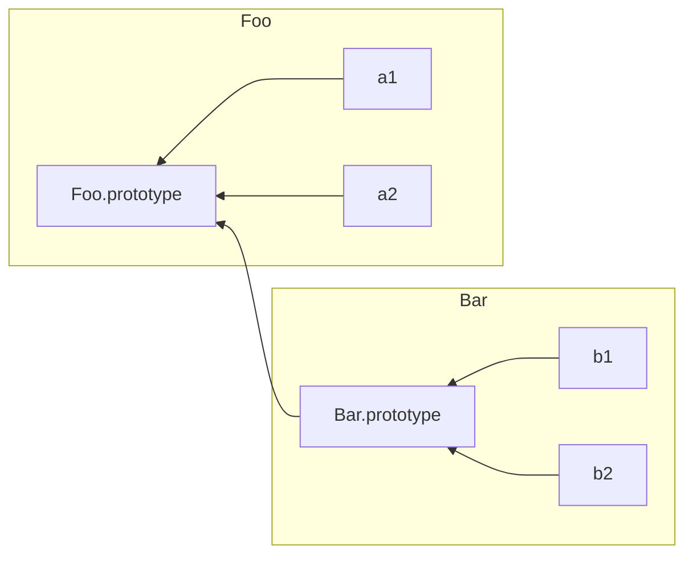

# Prototipovi

## Svojstvo [[Prototype]]

Svi objekti imaju interno svojstvo [[Prototype]] i cija vrednost je obicna referenca na neki drugi objekat.

```js
var myObj = {
  a: 2
}

myObj.a; // 2
```

Operacija [[Get]], koja se izvrsava kada referenciramo neko svojstvo objekta, kao sto je _myObj.a_.
Prvi korak je utvrdjivanje da li objekat sadrzi trazeno svojstvo, ako ga ima to se i koristi.
A ako [[Get]] operacija ne nadje trazeno svojstvo, ono nastavlja da sledi [[Prototype]] vezu ka drugom objektu.

```js
var anotherObj = {
  a: 2;
}

// pravi objekat povezan sa objektom 'anotherObj'
var myObj = Object.create(anotherObj);

myObj.a; // 2
```

Ovim postupkom dobijamo objekat _myObj_ koji je kroz svoje svojstvo [[Prototype]] povezans objektom _anotherObj_

**Ako _anotherObj_ ne bi imao svojstvo _a_, koje trazimo, [[Get]] operator bi trazio dalje kroz [[Prototype]] lanac** povezanih objekata da li se negde nalazi trazeno svojstvo.

Ako operator [[Get]] prodje ceo [[Protoype]] lanac, a **ne nadje trazeno svojstvo, operator vraca vrednost _undefined_**.

Slicna pretraga se dogadja kada petljom _for..in_ prolazimo kroz objekat.

```js
var anotherObj = {a:2};

var myObj = Object.create(anotherObj);

for(var k in myObj){
  console.log("ima svojstvo: " + k);
};
// ima svojstvo: a

("a" in myObj); // true
```

Kada trazim imena svojstava, bez obzira na oblik kojim to izvodim, uvek se pretrazuje [[Prototype]] lanac, veza po veza. Pretraga se prekida kada se nadje svojstvo ili ako se lanac zavrsi.

### Objekat Object.prototype

Pocetak svakog normalnog [[Prototype]] lanca je ugradjeni objekat _Object.prototype_. On sadrzi vise raznih funkcija koje se koriste u celom JS-u, zato sto svi _normalni objekti_ (oni ugradjeni, ne spoljasnji specifinci za radno okruzenje) poticu od _Object.prototype_ objekta.

### Zadavanje i zaklanjanje svojstava

```js
myObj.foo = "bar";
```

Ako objekat _myObj_ vec sadrzi svojstvo pod imenom _foo_, ova linija koda ce samo izmeniti vrednost tog svojstva.

Ako svojstvo _foo_ ne postoji u objektu _myObj_, a daljim ispitivanjem ni u [[Prototype]] lancu, svojstvo _foo_ sa vrednoscu se direktno dodaje u objekat _myObj_.

**Zaklanjanje** - ako svojstvo istog imena postoji i u samom objektu a i u visim nivoima [[Prototype]] lanca.

>Svojsto _foo_, koje postoji u objektu _myObj_, zaklanja svaku drugu definicu istog tog svojstva u visim nivoima lanca

Kada masina stigne do linije koda napisane u primeru, ako objekat direktno ne sadrzi svojstvo _foo_, vec se ono pojavljuje u lancu, tada:

1) Ako u lancu postoji svojstvo za pristupanje podacima koje se zove _foo_ i nije podeseno kao svojstvo samo za citanje (_writable: true_), objektu _myObj_ se direktno dodaje novo svojstvo _foo_, sto rezultuje zaklanjanju.
2) Ako u lancu postoji svojstvo _foo_ ali je oznaceno kao svojstvo samo za citanje (_writable: false_), onda se ne moze ni napraviti novo svojstvo direktno u objektu _myObj_, a niti se moze redefinisati postojece svojstvo. Ako kod radi u striktnom rezimu, generise se greska, u suprotnom greska se zanemaruje u tisini.
3) Ako svojstvo _foo_ postoji u lancu i pridruzena mu je samo funkcija za dodeljivanje vrednosti, ta funkcija se uvek poziva. Objektu _myObj_ se ne dodaje svojstvo _foo_ niti se redefinise funkcija _foo_ za zadavanje vrednosti svojstava.

>Nisam razumeo na sta se misli kao svojstvo za pristupanje podacima, ali sam otkrio da je to _[[Get]]_
>
>A kao funkcija za dodeljivanje vrednosti _[[Put]]_

Zaklanjanje vec postojeceg svojstva u objektu je, linijom koda u primeru, moguce samo u slucaju 1).

Ako bi zeleli da zaklonimo svojstvo ako smo u situaciji opisanoj u 2) i 3), tada mozemo da to uraditi samo rucnim dodavanjem svojstva objektu.

>Object.defineProperty(...);

Zaklanjanje je suvise slozeno, pa bi ga trebalo izbegavati.

Primer implicitnog zaklanjanja:

```js
var anotherObj = {
  a: 2
};

var myObj = Object.create(anotherObj);

anotherObj.a; // 2
myObj.a; // 2

anotherObj.hasOwnProperty("a"); // true
myObj.hasOwnProperty("a"); // false

myObj.a++; // implicitno zaklanjanje

anotherObj.a; // 2
myObj.a; // 3

myObj.hasOwnProperty("a"); // true
```

Operacija ++ ekvivalenta je operaciji _myObj.a = myObj.a + 1_. Rezultat je pretraga operacije [[Get]] za svojstvom _a_, koje pronalazi u lancu, a zatim je ovo primer 1), inkrementira se nadjena vrednost svojstva i operacija [[Put]] postavlja vrednost direktno u objekat _myObj_, sto dovodi do zaklanjanja.

## "Klasa"

JavaScript nema apstraktne modele koji se zovu klase, on ima samo objekte.

U JS-u ne mogu opisati sta jedan objekat moze da radi, jer on sam definise sopstveno ponasanje.

### Funkcije "klase"

Prilikom deklaracije funkcije, ona dobija javno, nenabrojivo svojstvo cije je ime _prototype_, i koje upucuje na neki proizvoljan objekat.

```js
function Foo(){
  // ...
}

Foo.prototype; // { }
```

Svaki objekat napravljen pomocu rez. reci _new_ (_new Foo()_) biti povezan putem svojstva [[Prototype]] sa svojim "Foo tacka prototip" objektom.

```js
function Foo(){
  // ...
}

var a = new Foo();

Object.getPrototypeOf(a) === Foo.prototype; // true
```

Pozivanjem _new Foo()_ pravim svojstvo _a_, koje se, ispod haube, interno povezuje sa [[Prototype]] vezom objekta na koji upucuje _Foo.prototype_.

U JS-u, za razliku od OOP jezika, pravljenjem instanci ustvari pravim internu vezu izmedju [[Prototype]] objekata instanciranih objekata.

Rezultat pozivanja _new Foo()_ je novi objekat koji smo nazvali _a_, a taj novi objekat je interno, preko svog [[Prototype]], povezan s objektom Foo.prototype. To su ustvari samo dva medjusobno povezana objekta. Nista drugo. Nije instancirana ni jedna klasa. A nismo ni kopirali nikakvo ponasanje iz neke "klase".

#### Sta je u imenu?

**U JavaScriptu ne pravimo kopije jednog objekta ("klase") u drugi ("instancu"), nego uspostavljamo veze izmedju njih.**



Ovaj mehanizam se cesto naziva _prototipsko nasledjivanje_ (engl. _prototype inheritance_)

Autor dodavanje reci "prototipsko" uz "nasledjivanje" poredi sa:

>Kao kada drzimo u jednoj ruci pomorandzu, a u drugoj jabuku i uporno tvrdimo da je jabuka "crvena pomorandza". Bez obzira koliko zbunjujuci pridev dodamo ispred jabuka, to ne menja cinjenicu da je jedno voce pomorandza, a drugo jabuka.

_Nasledjivanje_ podrazumeva operaciju _kopiranja_, a JavaScript ne kopira svojstva objekta. Umesto toga, JS uspostavlja vezu izmedju dva objekta,u kojoj jedan objekat **delegira** drugom objektu pristupanje datom svojstvu/funkciji.

### "Konstruktori"

```js
function Foo(){
  // ...
}

Foo.prototype.constructor === Foo; // true

var a = new Foo();

a.constuctor === Foo; // true
```

Objakat _Foo.prototype_ standardno dobija nenabrojivo, javno svojstvo _.constructor_ cija je vrednost referenca na objekat funkcije (u ovom slucaju Foo). Objekat _a_ napravljen konstruktorskim pozivom funkcije _Foo_ izgleda kao da ima sopstveno svojstvo _.constructor_ i koje isto upucuje na objekat koji ga je napravio (Foo).

>To ustvari nije tacno.
>
>Objekat _a_ zapravo nema svojstvo _.constructor_, vec se to razrezava pregledom kroz [[Prototype]] lanac, gde nalazi u funkciji Foo

#### Konstruktor ili konstruktorski poziv

Funkcije nisu konstruktori, ali pozivi funkcija su "konstruktorski pozivi", ako i samo ako pritom upotrebim operator _new_.

### Mehanika

```js
function Foo(name){
  this.name = name;
}

Foo.prototype.myName = function(){
  return this.name
}

var a = new Foo("a");
var b = new Foo("b");

a.myName(); // "a"
b.myName(); // "b"
```

Ovaj primer prikazuje upotrebu dva dodatna "klasno orijentisana" trika:

1) _this.name = name_ dodaje svojstvo _.name_ svakom objektu, slicno obliku u kojem instance kapsuliraju vrednosti podataka
2) _Foo.prototype.myName = ..._ dodaje svojstvo (funkciju) objektu _Foo.prototype_.

Zbog nacina na koji su napravljeni ovi objekti (povezani su s [[Prototype]] objektom funkcije _Foo_), mogu da pristupe funkciji _myName()_.

#### Ponovo o "konstruktoru"

**_.constructor_ ne znaci "objekat koji je konstruktor ovog objekta"**.

Vrednost svojstva _Foo.constructor_ veoma je nepouzdana i nebezbedna referenca za upotrebu u kodu. Njihova upotreba se treba izbegavati gde god je to moguce.

## (Prototipsko) nasledjivanje

```js
function Foo(name){
  this.name = name;
}

Foo.prototype.myName = function(){
  return this.name;
}

function Bar(name, label){
  Foo.call(this, name);
  this.label = label;
}

// Dodaje se novo svojstvo objekta Bar, prototype,
// koji se povezuje s Foo.prototype
Bar.prototype = Object.create(Foo.prototype);

// Prethodnom linijom smo "izbrisali" svojstvo
// `Bar.protoype.constructor`, pa ga zato sada
// treba rucno ispraviti
Bar.prototype.myLabel = function(){
  return this.label;
}

var a = new Bar("a", "obj a");

a.myName(); // "a"
a.myLabel(); // "obj a"
```

>```js
>Bar.prototype = Object.create(Foo.prototype);
>```
>
>Linija koda koja pravi novo svojstvo _prototype_ u objektu _Bar_, koje interno povezuje sa [[Prototype]] lancem objekta _Foo_

```js
// Postoje jos dva nacina koja bi
// mogla da padnu nekome napamet
Bar.prototype = Foo.prototype;

/*
// Ovde bi svojstvo prototype objekta Bar bilo
// povezano referencom na svojstvo prototype
// objekta Foo.
// U ovom bi slucaju, kada definisem svojstvo
// myLabel() menjao deljenji (Foo.prototype)
// sto znaci da bi to promena uticala na
// svaki povezan objekat
*/

Bar.prototype = new Foo();

/*
// Ovaj poziv ne povezuje svojstvo prototype
// objekta Bar sa prototype svojstvom objekta
// Foo, vec pravi instancu celog objekta,
// sto nam u ovom slucaju ne treba
*/
```

ES6 je uveo standardizovan nacin povezivanja objekata _Bar.prototype_ i _Foo.prototype_:

```js
// pre ES6
// odbacuje se postojeci objekat 'Bar.prototype'
Bar.prototype = Object.create(Foo.prototype);

// ES6
// menja postojeci objekat 'Bar.prototype'
Object.setPrototypeOf(Bar.prototype, Foo.prototype);
```

### Utvrdjivanje veza izmedju "klasa"

**Introspekcija** (**refleksija**) proces ispitivanja da li objekat ima neki lanac, odnosno, da li je on napravljen tako da nasledjuje neki objekat.

```js
function Foo(){
  // ...
}

Foo.prototype.blah = ...;

var a = new Foo();
```

Jedan od resenja pitanja 'Kako saznati ko su preci objekta _a_' je koriscenje operatora _instanceof_.

1) Nacin

    ```js
    a instanceof Foo; // true
    ```

    >Operator _instanceof_ sa svoj leve strane prima obican objekat, dok sa svoje desne strane ocekuje funkciju.
    >
    >Radi tako sto pregleda da li se negde u [[Prototype]] lancu objekta _a_ pojavljuje objekat na koji upucuje _Foo.prototype_

    U slucaju da uporedjujem dva nasumicna objekta, koriscenje samo operatora _instanceof_ nece biti dovoljna.

    ```js
    /*
    // pomocna funkcija za utvrdjivanje da li
    // je objekat 'o1' povezan s objektom
    // (delegira objektu) 'o2'
    */
    function isRelated(o1, o2){
      function F();
      F.prototype = o2;
      return o1 instanceof F;
    }

    var a = {};
    var b = Object.create(a);

    isRealted(b, a); // true
    ```

    >Besmisleno je ispitivati povezanost dva objekta pomocu "klasnog" _instanceof_ prilaza.
    >
    >U f-ji _isRelated(..)_ ispitujem da li je _o1_ instanca novonapravljene _F_ f-je. Iako _o1_ nema nikakve veza sa _F_, f-ja je vratila potvrdan odgovor

2) Cistiji nacin ispitivanja [[Prototype]] lanca:

    ```js
    Foo.prototype.isPrototypeOf(a); // true
    ```

    >Metoda _isPrototypeOf(..)_ odgovara na pitanje:
    >
    >u celom [[Prototype]] lancu objekta _a_, da li se negde pojavljuje isti objekat na koji upucuje i svojstvo _Foo.prototype_?

JS programeri su smislili rec za naziv dve donje crtice __ - **dander (dunder)**.

Zato bi se za "__prot\__" citalo _dander prots_.
