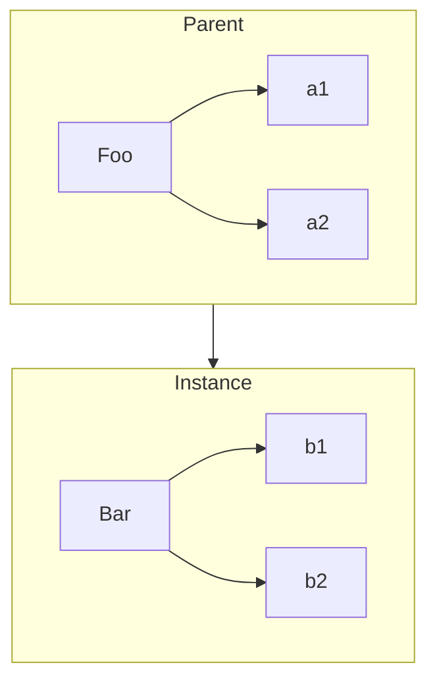

# Mesanje objekta "klasa"

## Teorija klasa

Pojam klasa/nasledjivanje opisuje odredjen oblik organizovanja i arhitekture koda.

OOP istice da je priroda podataka da se uz njih uvek vezuje odredjeno ponasanje koje uticu na podatke, pa zato ispravan dizajn treba da spakuje zajedno i podatke i ponasanja.

>Grupa znakova koja predstavlja rec ili recenicu govornog jezika se naziva znakovni niz (string). Znakovi su podaci.
>
>Gotovo nikada nisu vazni samo podaci, vec obicno sa njima nesto radimo, pa se zato sva ponasanja koja se mogu primeniti na te podatke realizuju u obliku metoda klase String
>>Izracunavanje duzine stringa, dodavanje novih podataka, pretrazivanje...

Svaki znakovni niz je instanca svoje klase -> vesto upakovan paket podataka i funkcionalnosti koju mozemo primeniti na njih.

Svaku strukturu zamisljamo kao specificnu varijantu opstije osnove definicije.

>Kao primer mozemo uzeti _Automobil_, za koga se moze reci da je specificnija varijanta opstije klase koja se zove _vozilo_

**Polimorfizam** ideja da se dato opste ponasanje (deklarisano u roditeljskoj klasi) moze zameniti tako da se postigne specificnije ponasanje.

>Praksa je da se zamenjenoj funkciji u izvedenoj klasi ostavi isto ime funkcije kao u roditeljskoj

### Model projektovanja softvera pomocu "klasa"

_Proceduralno programiranje_ nacin za opisivanje koda koji se sastoji iskljucivo od procedura (funkcija) koje pozivaju druge funkcije.

Primena klasa je ispravan nacin da proceduralni "spageti kod" pretvorimo u pravilno formatiran i dobro organizovan kod.

### JavaScript "klase"

JavaScript, za razliku od OOP jezika, nema klase.

Ono sto je ES6 od skoro uveo, rezervisanu rec _class_ je samo pokusaj neke implementacije koriscenja klasa.

>U ovom momentu sam shvatio zasto autor stavlja u naslovu navodnike na reci klase.

## Mehanika klasa

U mnogim jezicima koji su orijentisani na klase, "standardna biblioteka" stavlja na raspoljaganje strukturu podataka tip _stek_ u obliku klase koja se zove _Stack_.

### Zgrada

Metafora za "klase" i "instance" pozajmljena je iz gradjevinarstva.

Klasa se moze zamisliti kao arhitektonski crtez zgrade.

Arhitekta na crtez ucrtava sirinu, visinu, broj prozora, na kojoj visini, sirini... On ne brine o tome cime ce ta zgrada biti popunjena (stanovi, kancelarije...) vec gleda samo siroku sliku.

Zatim preduzimac preuzima taj crtez i primenjuje ga na pravi svet, praveci stvarnu kopiju prema onome sto mu je arhitekta nacrtao. Moze se desiti da je na crtezu ucrtan neki deo koji ne moze biti primenjen na stvarnom svetu, pa ce morati biti dorade (menjanje svhe funkcije tako da odgovara izvedenoj klasi).

Kada zavrsi sa tom zgradom, preduzimac moze da nastavi da gradi zgrade po tom istpom principu koji mu je predlozio arhitekta (mogu da izvodim vise klasa iz osnovne).

Crtez je samo klasa, sa njim ne mogu fizicki nista uraditi. Ako zelim otvoriti vrata zgrade, moram napraviti instancu crteza (moram izgraditi zgradu).

Klasa se instacira u objektni oblik pomocu operacije kopiranja:



### Konstruktor

Kada pravimo instancu klase mi ustvari pozivamo specijalnu metodu unutar parent objekta koji ima ime parent klasa i koja se zove **konstruktor**. Od konstruktora dobijamo (funkcija vraca) objekat.

```js
// Ovo je samo pseudokod

class CoolGuy {
  specialTrick = nothing;

  CoolGuy(trick) specialTrick = trick;

  showOff() output("Evo sta ja umem: " + specialTrick);
}

// Da bi napravio instancu klase _CoolGuy_ moram pozvati njen konstruktor

Tim = new CoolGuy("da preskacem konopac");
Tim.showOff(); // "Evo sta ja umem: da preskacem konopac"
```

Konstruktore uvek treba pozivati uz rez. rec _new_ kako bi masini nagovestili da zelimo napraviti novu instancu klase.

## Nasledjivanje klasa

Cesto se kaze da je druga klasa "izvedena", a prva klasa "roditelj".

Kada dete zapocne svoj zivot, ono se razdvaja od roditelja. Na dete utice genetsko nasledje koje je dobilo od svog roditelja, ali ono je zasebna jedinka. Ako dete ima ridju kosu, to ne znaci da je kosa roditelja obavezno bila ridja, niti da ona automatski postaje ridja.

> Metafora na izvedenu i roditeljsku klasu.
>
>Kada napravimo instancu klase, ona je zasebna za sebe. Nasledila je ponasanja roditelja, ali je to ne sprecava da menja ta ponasanja ili cak da i doda nova ponasanja

```js
// pseudokod (izmisljena sintaksa)

class Vehicle{
  engines = 1;

  ingnition() output("Pokrecem motor");
  drive(){
    ingnition();
    output("Vozilo je u pokrtu");
  }
}

class Car inhrits Vehicle{
  wheels = 4;

  drive(){
    inherited:drive()
    output("Vozim na ", wheels, " tocka");
  }
}

class SpeedBoad inherts Vehicle{
  engines = 2;

  ingnition() output("Pokrecem ", engines, " motora");

  pilot(){
    inherited: drive();
    output("Brzo i lako klizim po vodi");
  }
}
```

>Klasa _Vehicle_ je genericka klasa, jer se sa njom ne mogu praviti vozila, vec smo to ucinili praveci instance genericke (_Vehicle_) i dodavajuci im potrebna dodatna ponasanja

### Polimorfizam

Nastvaljajuci se na prethodni primer o vozilima, klasa _Car_ redefinise nasledjenu metodu _drive()_.

Ova tehnika se naziva **polimorfizam**. Praktikuje ideju da svaka metoda moze da referencira drugu metodu (istog ili razlicitog imena) na visem hijerarhijskom nivou nasledjivanja.

U nekim se jezicima umesto _inherited:_ koristi rez. rec _super_ (sto odrazava ideju da je "superklasa" roditelj/predak tekuce klase)

Jos jedna ideja polimorfizma jeste da jedno ime metode moze imati razlicite definicije na razlicitim nivoima lanca nasledjivanja. Tada se definicija automatski bira  kada se razresava koja je tacno metoda pozvana.

>Mozemo videti u primeru za vozila, metoda _drive()_ je definisana u klasi _Vehicle_ ali takodje i u klasi _Car_.
>
>Takodje i za metodu _ingnition()_ koja je definisana u klasi _Vehicle_ i u klasi _SpeedBoat_
>
>Koja ce definicija metode biti pozvana zavisi od toga na kom se nivou lanca nasledjivanja nalazimo

Tradicionalni jezici orijentisani na klase pruzaju, pomocu rezervisane reci _super_, direktan nacin da konstruktor nasledjene klase referencira konstruktor svoje roditeljske klase. To je izvodljivo najvecim delom jer u stvarnim klasama konstruktor pripada klasi.

U JavaScriptu je to malo drugacije, u njemu je primer da "klasa" primada konstruktoru. Razlog je taj sto u JS-u veza izmedju izvedene i roditeljske klase postoji samo izmedju dva _.prototype_ objekta odgovarajucih konstruktora. Nema direktne veze izmedju samih konstruktora, pa zato ni nema jednostavnog nacina da se relativno referencira jedan iz drugog.

Zanimljiva posledica polimorfizma moze se konkretno videti na primeru metode _ignition()_. U metodi _pilot()_ postoji relativna polimorfna referenca na verziju metode _drive()_ koja je nasledjena od klase _Vehicle_. Ali ta metoda _drive()_ referencira metodu _ignition()_ samo po imenu.

U tom slucaju definicija metode _ignition()_ je polimorfna (promenljiva), zavisno od toga cija je instanca klase koju referenciramo.

**Svaka izvedena klasa ima kopiju onoga sto joj treba od roditeljske klase.**
